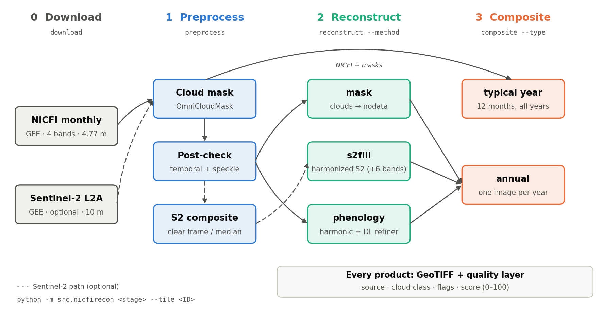

# nicfirecon: a general NICFI reconstruction pipeline

One package, `src/nicfirecon/`, one command line, three stages; nothing is
specific to a tile (`--tile <ID>`, months discovered from disk). First full
test tile: **D17**, 60 months (2021-01..2025-12) of NICFI + 379 raw,
unmasked single-date Sentinel-2 frames.



```bash
python -m src.nicfirecon download    --tile D99 --start 2021-01 --end 2025-12 \
        --bbox -61.36 -10.28 -61.27 -10.19 --ee-project <gee-project>   # new tile from GEE
python -m src.nicfirecon preprocess  --tile D17          # masks, post-check, S2 composites
python -m src.nicfirecon reconstruct --tile D17 --method s2fill --add-s2-bands
python -m src.nicfirecon reconstruct --tile D17 --method phenology
python -m src.nicfirecon composite   --tile D17 --type typical-year
python -m src.nicfirecon composite   --tile D17 --type annual --source s2fill
python -m src.nicfirecon run --config configs/D17.yaml   # the whole chain from one file
python -m src.nicfirecon <stage> --help                  # every option
```

| stage | options | what it does |
|---|---|---|
| `download` | `--start/--end YYYY-MM`, `--bbox` or `--aoi FILE [--aoi-id-field]`, `--sensors nicfi,s2`, `--ee-project`, `--nicfi-region`, `--s2-max-cloud` | NICFI monthly basemaps (region from the AOI's longitude) on their native 4.77 m EPSG:3857 grid, plus raw unmasked Sentinel-2 L2A frames (same-day granules mosaicked, 10 bands, ~10 m EPSG:4326), from Google Earth Engine, into exactly the input layout below; chunked, parallel, resumable. Adapted from `/mnt/super/code/nicfi_download.py`. Needs `earthengine authenticate` once. *Not yet run against GEE; its output grids were checked offline to match D17's existing files.* |
| `preprocess` | `--steps mask,postcheck,s2composite`, `--sensors nicfi,s2`, `--no-temporal`, `--min-cloud-area`, `--s2-clear-thresh`, `--s2-buffer-px` | OmniCloudMask ensemble per observation (both sensors, GPU, resumable) → temporal + spatial post-check → monthly clear S2 composite. S2 steps are skipped if the tile has no S2 frames. |
| `reconstruct` | `--method mask` | contaminated + nodata NICFI pixels set to nodata; the conservative product |
| | `--method s2fill [--add-s2-bands]` | contaminated pixels replaced by same-month harmonized S2; `--add-s2-bands` appends S2 B5/B6/B7/B8A/B11/B12 (10 bands) |
| | `--method phenology [--no-refiner] [--n-clusters]` | the temporal method of `docs/amazon.md` (harmonic phenology + cluster priors + continuous confidence + DL refiner) on the whole tile series |
| `composite` | `--type annual --source nicfi\|mask\|s2fill\|phenology [--stat lowblue\|median] [--min-score]` | one image per year from any monthly source, using its quality score |
| | `--type typical-year [--stat]` | 12 monthly images from all years of NICFI only |
| `visualize` | `--what preprocess\|reconstruct\|typical-year\|annual` | re-draw figures (every stage draws its own unless `--no-figures`) |

Inputs (defaults, overridable with `--nicfi-dir/--s2-dir/--data-root`):
`<data-root>/<TILE>/*YYYY-MM.tif` (NICFI) and optionally
`<data-root>/<TILE>_S2/YYYY-MM-DD.tif` (raw Sentinel-2, band descriptions
B2..B12). Outputs in `outputs/nicfirecon/<TILE>/`: `cache/`,
`reconstructed/<method>/`, `composites/{annual/<source>,typical_year}/`,
`figures/{preprocess,reconstruct/<method>,composite}/`. Every product
GeoTIFF has named bands and a `_quality.tif` next to it.

## D17 results by method (`configs/D17.yaml`, 42 min end to end on one RTX 3090)

Mean over 60 months, % of the tile by data source (from each method's
`stats.json`; the remaining ~1% is the tile-edge nodata border):

| method | NICFI clear | filled | contaminated left | mean score |
|---|---|---|---|---|
| `mask` | 88.6 | -- | 10.4 (masked to nodata) | 88 |
| `s2fill` | 88.6 | 2.5 (S2: 0.9 single frame, 1.7 median) | 7.8 (kept, no clear S2) | 91 |
| `phenology` | 85.5 | 13.5 (3.1 model, 10.4 blended) | 0 | 94 |

- `s2fill` replaces ~24.5% of all NICFI contamination -- limited by
  Sentinel-2 being cloudy in the same wet-season months -- but where it
  fills, it's a real same-month observation.
- `phenology` leaves nothing contaminated, at the cost of model values
  (harmonic curve + refiner) instead of observations; per-pixel weights and
  the `phenology blend` source say how much.
- Composites: typical year 98.8-98.9% clear same-month coverage per
  calendar month; annual from `s2fill` / `phenology`: 99.0 / 98.9% of
  pixels from months scoring >= 50, ~10-12 usable months per pixel. The
  2021 annual has a darker north-east patch where the least-hazy rule picks
  dark observations.
- Found during the refactor: the S2 haze-test blue references were cached
  once and never rebuilt, so they still reflected the raw masks after the
  post-check changed them; `s2composite` now rebuilds them every run. The
  refactor itself was checked to reproduce the previous outputs bit for bit
  (s2fill months, typical-year composites) before that fix.

## Method

1. **Sentinel-2 cloud mask per frame** -- OmniCloudMask, the same
   2-generation ensemble as NICFI (`cloud_mask.ocm_ensemble`), thick/thin
   cloud + shadow, buffered 3 px (30 m).
2. **Haze rejection on top of OCM** -- OCM-clear observations whose blue
   is > max(100 DN, 0.5x) above that pixel's per-year reference (25th
   percentile of its OCM-clear blue) are dropped, then the mask is opened
   to remove speckle. Needed: on 2021-01, OCM-"clear" S2 had blue median
   393 vs ~190 for clear forest.
3. **Temporal post-check of both cloud masks** (`temporal_mask.py`) --
   clouds move, ground doesn't. A pixel flagged in >= 25% (and >= 3) of the
   *mostly-clear* observations (scene <= 30% contaminated) is "persistent";
   for those pixels only, a flag is overridden to clear in any observation
   where it looks like the pixel's typical appearance (median blue/NIR over
   mostly-clear observations; blue within max(80 DN, 35%), NIR within
   max(400 DN, 25%)). A real cloud (much brighter blue) or shadow (much
   darker NIR) over the same spot keeps its flag. D17: NICFI 6.1% of pixels
   persistent, 15% of all NICFI flags overridden -- mostly pink/bright
   canopy and bare patches OCM calls cloud at 4.77m; Sentinel-2 at 10m:
   none. Then a **spatial** check: clouds are spatially coherent, so
   flagged blobs smaller than 2500 m² (110 NICFI px / 26 S2 px) are
   cleared as speckle, and clear holes that small inside a cloud are filled
   with the nearest flagged class (D17: 633k NICFI and 63k S2 pixel-obs
   changed). Without it, every isolated flag became a 7x7 hole after the
   3 px buffer, and every isolated clear pixel inside a cloud stayed
   unreplaced -- the speckle in the fills. The same clean-up is applied to
   the S2 haze-test rejections and the final S2 clear mask. Raw OCM classes
   are kept in the cache next to the re-checked ones.
4. **Monthly S2 composite** -- if the clearest frame is clear over >= 99%
   of the tile, that *single* frame is used (one coherent acquisition); else
   the per-pixel median of clear observations. D17: 17 months single-frame,
   43 median.
5. **NICFI quality mask** -- the existing OCM ensemble + haze heuristic
   (`cloud_mask.compute_masks`), buffered 3 px (~15 m).
6. **Harmonization S2 -> NICFI, per month and local** -- robust quantile
   matching (slope = NICFI p10-p90 spread / S2 spread, intercept from the
   medians) on pixels clear in both, at 10 m. First a whole-tile fit (the
   prior + a trust check), then refined per ~640 m block, shrunk toward the
   prior where a block has few clear-in-both pixels, and smoothed across
   blocks. Applied at 10 m, then upsampled bilinearly to NICFI's 4.77 m.
7. **Replacement** -- contaminated/nodata NICFI pixels with clear S2 under
   them get the harmonized S2; the blend ramps *outward* over 8 px into
   clear NICFI (never lets a cloudy pixel through at partial weight).

Outputs per month in `outputs/nicfirecon/<tile>/reconstructed/<method>/`:
`<tile>_<month>.tif` (uint16, NICFI scale; 4 bands, or 10 with
`--add-s2-bands`) and `<tile>_<month>_quality.tif`, a 5-band uint8
**data-quality layer**, the same for every method:

| band | name | values |
|---|---|---|
| 1 | `source` | 0 NICFI clear · 1 S2 single cloud-free frame · 2 S2 median of clear obs · 3 contaminated NICFI (s2fill: kept, no clear S2; mask: masked) · 4 nodata · 5 phenology reconstruction · 6 phenology blend |
| 2 | `nicfi_class` | NICFI cloud class after the temporal check: 0 clear · 1 thick · 2 thin · 3 shadow · 4 haze · 5 nodata |
| 3 | `flags` | bit 1: NICFI flag cleared by the post-check (temporal or speckle) · 2: edge blend (clear NICFI mixed with S2) · 4: S2 fit borrowed (year median) · 8: replaced only as cloud buffer |
| 4 | `s2_n_clear` | clear S2 observations that month (s2fill) |
| 5 | `score` | 0-100 heuristic confidence: NICFI clear 100 (cleared flag 90, edge blend 95); S2 single frame 80; S2 median 70 (>= 3 obs) / 60 (2) / 50 (1); -15 if the fit was borrowed; kept contaminated: buffer-only 60, haze 30, thin 20, shadow 10, thick 0; masked 0; phenology 100·w + 45·(1-w) for observation weight w; nodata 0 |

The score is a ranking aid for users, not a calibrated accuracy -- there's
no ground truth behind it. Figures in `.../figures/`.

## Why these choices (bugs/failures found on the way)

- **RANSAC regression -> quantile matching.** RANSAC returned slopes of
  0.3-0.65 even on a clean month (2021-06, r=0.85-0.93 in the visible
  bands): its default inlier band locks onto the dense forest cluster where
  the relation looks flat (regression dilution) -- every fill would have
  been washed out. On a noisy month it went negative. Quantile matching
  gives 0.74-1.02 on 2021-06 and can't flip sign.
- **Whole-tile fit -> local fit.** A NICFI monthly basemap stitches several
  PlanetScope scenes: on 2021-01 the lower tile has ~4x less green/red
  contrast than June over the same forest (p10-p90 green 31 vs 123 DN, same
  medians), the upper tile doesn't. One fit can't match both.
- **Super-resolution dropped.** SEN2SR (10 m -> 2.5 m) was tested on an
  earlier tile: faithful to its own input but no better than bilinear
  against NICFI, at ~17 GPU-min/month -- see `docs/super-resolution.md`.

## Results on D17, s2fill (`figures/reconstruct/s2fill/`, `figures/preprocess/postcheck.png`)

- **Works where S2 saw the ground.** Thick cloud removed cleanly with no
  visible seam in e.g. 2024-04 (S2 median), 2025-02 (single frame
  2025-02-20, 40.6% of the tile replaced), 2025-05 (single frame). Fits are
  well-determined: clear-in-both red r 0.70-0.98, median 0.94, no month
  below the 0.6 trust threshold; 4 months had too few clear-in-both pixels
  and borrowed their year's median fit.
- **Main limitation: the wet season.** When NICFI is cloudy, S2 usually is
  too: 2021-12 (70.8% contaminated, S2 composite 0% clear -> 0% replaced),
  2021-02, 2022-03, 2024-12, 2025-12 all keep most contamination. Of all
  NICFI contamination over 60 months, about 24.5% gets replaced (after the temporal + spatial checks; mean per-pixel quality score over all months 91/100).
- **2024-09 is smoke, not cloud** (fire season): 98% of the tile flagged
  thin cloud in NICFI, S2 equally affected; nothing to replace it with.
- **Residual S2 contamination in medians.** Some median-composite fills
  still carry faint cloud (e.g. 2024-03, 2025-09 windows). Isolated speckle
  is gone after the spatial check; what remains in hazy wet-season months
  are larger, worm-shaped gaps -- S2's own fragmented clear area, a real
  data limit rather than noise.
- **Thin cloud is still over-called on NICFI in some months** (e.g. the
  2023-02 window: a fairly clear-looking scene mostly flagged thin cloud).
  Not persistent in time, so the temporal check can't catch it.
- The temporal check shares the limitation noted in `docs/amazon.md`: haze
  that recurs at the same spot often enough becomes part of that spot's
  "typical appearance" and could be overridden too.
- No independent ground truth: judged visually and via the fit statistics.

## Typical-year composite: 12 months from all NICFI years (`composite --type typical-year`)

`src/nicfirecon/composite.py` builds 12
monthly images from NICFI only, no Sentinel-2: for calendar month k, every
year's month-k observation is a sample of that place in month k, and a
pixel cloudy in one year is usually clear in another.

- Clear = NICFI class after both post-checks, outside the cloud buffer.
- Per pixel, clear observations are ranked by blue (haze raises blue); the
  darkest is set aside as a possible unflagged shadow when there are >= 3,
  and the next one is taken as a whole 4-band observation. Two earlier
  versions failed visibly: the per-band median made February a hazy veil
  (4 of 5 Februaries carry undetected thin haze, so the median *is* haze);
  the lower quartile with floor() is the minimum for 3-4 clear years and
  left dark shadow blotches in the wet-season months.
- Every year is first normalized onto a first-pass composite with the same
  local quantile matching (NICFI -> NICFI), so pixels drawn from different
  years don't turn into patchiness. Fitted slopes are hard-clamped to
  [0.25, 4] (also for the S2 fill): a block whose band is nearly flat in one
  observation otherwise blew up -- the first December composite had a
  saturated red patch (13,804 DN from raw values of 127-431).
- Fallbacks, per pixel (`_quality.tif` band `tier`): clear same month ->
  clear adjacent months -> least-contaminated same-month observation.

Outputs: `composites/typical_year/<tile>_m<MM>.tif` + `_quality.tif`
(tier, n_clear_same, n_clear_adjacent); figures
`figures/composite/typical_year_{tiers,full_tile,area_*}.png` -- the area
figures use the same example windows as the reconstruction figures (every
year's original NICFI for each month, the composite, and the clear-year
count behind it).

**D17:** every calendar month is 98.8-98.9% filled from clear same-month
observations (the remaining ~1.05% is the tile-edge nodata border; adjacent
months are needed for <= 0.16%, least-contaminated never), with on average
3.3 (Dec) to 4.9 (May-Aug) clear years per pixel. Compared to the
S2-fusion route (~24.5% of contamination replaced), this is the much more
complete product -- at the cost of being a *typical* year, not a specific
one: it shows seasonality (e.g. the pink canopy flushes Jun-Oct), not
year-specific change such as a new clearing or the 2024 fire-season
smoke.

## Possible next steps

1. Widen the S2 window for cloudy months (e.g. +-15-30 days into adjacent
   months) -- the most direct way to cut the "kept" fraction in the wet
   season, at the cost of a temporal mismatch.
2. Use NICFI's own texture: take the nearest clear NICFI observation of a
   pixel and apply the S2-measured change between that date and this
   month (a STARFM-like approach) -- 4.77 m detail from NICFI, temporal
   signal from S2.
3. Stricter residual-cloud check on median composites (e.g. require >= 2
   agreeing observations, or a temporal consistency test per pixel).
